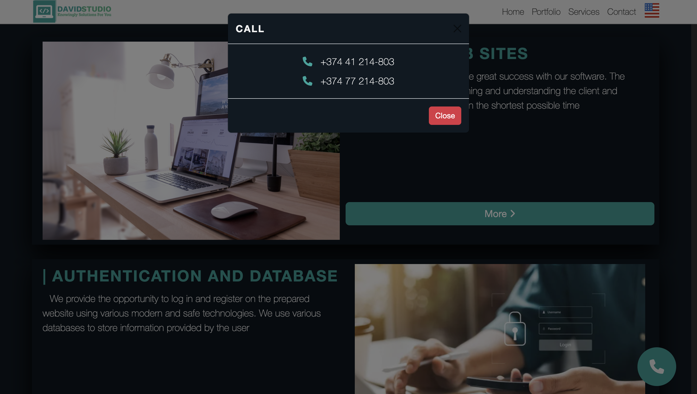

<a href="https://github.com/davidkhachatryan123/David-Studio">
   
</a>

# David Studio

David Studio is website of web development office.


## Getting Started

Make sure you have [installed](https://docs.docker.com/docker-for-windows/install/) docker in your environment and [configured](https://github.com/davidkhachatryan123/David-Studio/wiki/setup#configure-env-file) .env file. After that, you can run the below commands and get started with the `David Studio` immediately.

```
docker-compose -f docker-compose.yml -f docker-compose.prod.override.yml up -d
```

You should be able to browse different components of the application by using the below URLs:

```
Website:     https://x.x.x.x/
Admin Panle: https://x.x.x.x:4433/
```

Below are the other avenues to setup *David Studio*.

### Basic scenario

The basic scenario can be run locally using docker-compose. Refer to these Wiki pages to Get Started:

- [Docker compose](https://github.com/davidkhachatryan123/David-Studio/wiki/setup)

### Architecture overview

This reference application is cross-platform at the server and client side.

The architecture proposes a microservice oriented architecture implementation with multiple autonomous microservices (each one owning its own data/db) and each microservice using Http as the communication protocol between the client apps and the microservices and supports asynchronous communication for data updates propagation across multiple services based on Integration Events and an Event Bus (a light message broker RabbitMQ).

## Gallery

You can look at the images of website and admin panel below:

### David Studio Website:

| | | |
|:-------------------------:|:-------------------------:|:-------------------------:|
|  |  |  |
|  |  |  |
|  |  |  |

<br>

### David Studio Admin Panel:

| | | |
|:-------------------------:|:-------------------------:|:-------------------------:|
|  |  |  |
|  |  |  |